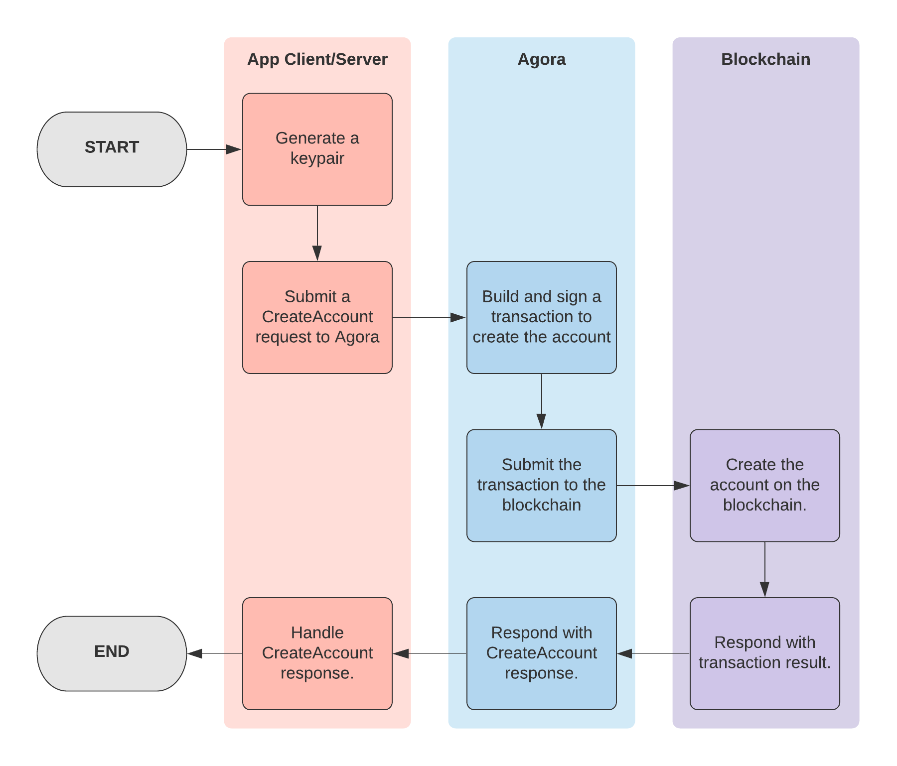
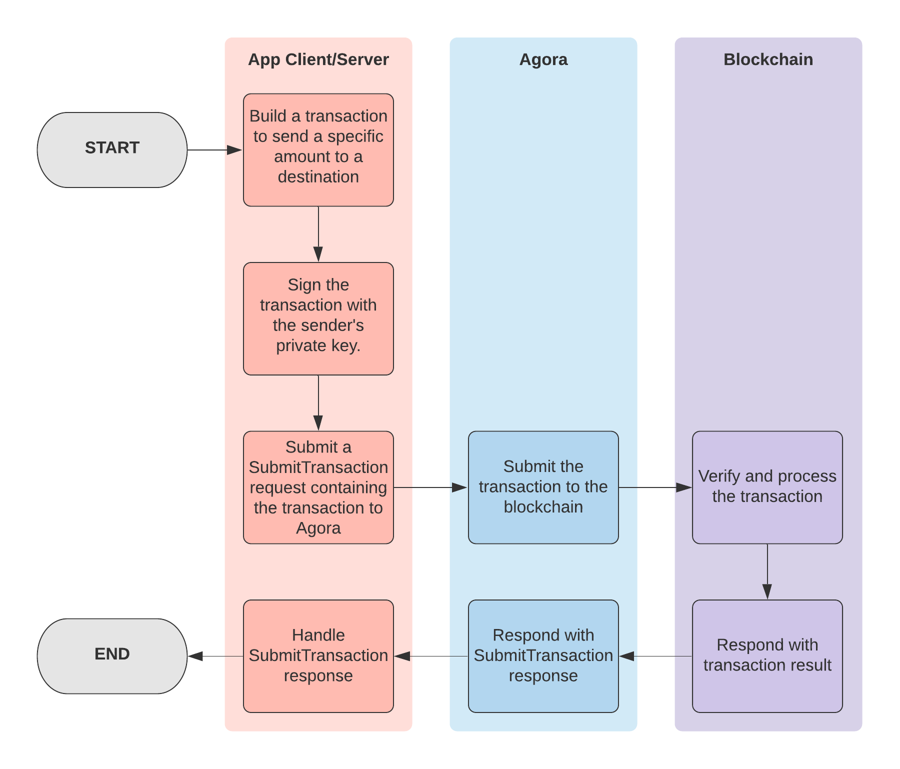
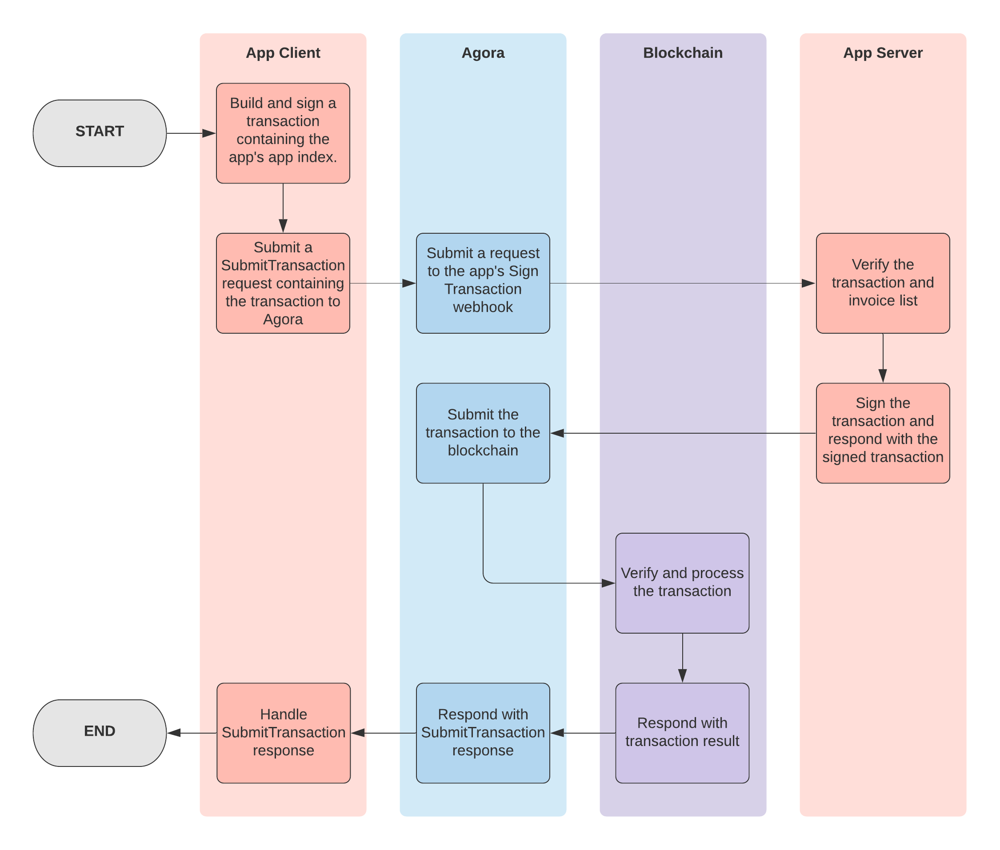

This section contains a description of how the client and server SDKs interact with Agora to create accounts and send Kin.

## Initial Setup

At a high level, setting up a Kin app requires the following steps:

1. Generate a [keypair](/terms-and-concepts#keypair) and register the app with the public key of the generated keypair to obtain an app index
2. Implement a Client SDK
3. Implement a Server SDK

### App Registration and Obtaining an App Index

To register an app, developers must provide their name, email, and app information via [this form](https://docs.google.com/forms/d/e/1FAIpQLSdz60FPmUB7qBq-TF7NNmRgM5W8wIqqL5oVHmMRbtBBXppv4Q/viewform). After submitting the form, an email will be sent within 24-48 hours with additional information for getting set up on the production and test environments. However, in order to receive rewards from the KRE or use specific Agora features, there are various other options that must be configured as well. These options and the full instructions for registration are outlined in full detail in the [App Registration](/app-registration) section. 

After an app has been registered, developers will be issued an **[app index](/terms-and-concepts#app-index)** for their app. Developers can then include it in the [memo](/how-it-works#kin-binary-memo-format) of transactions submitted by their app and app users, which allows them to get properly attributed to them. This then eventually gets used in the reward calculations done by the KRE. 

**Note:** To simply create accounts and submit payments without qualifying for the [Kin Rewards Engine](https://www.kin.org/kre/) or using features in the hosted Agora like [webhooks](/how-it-works#webhooks) and [invoicing](/how-it-works#invoices), apps are not required to register and can refer to [SDK documentation](/intro#available-sdks) to get started.

Otherwise, in order to benefit from the Kin Rewards Engine, have fee-less transactions, and/or make use of features in the hosted version of Agora, apps are currently required to register their app. 

### Implement a Client SDK

Implementing a Client SDK allows developers to give their users access to the Kin blockchain, and is typically the first step developers take to get their app integrated with Kin. Currently, two client SDKs are available:

- [Android](https://github.com/kinecosystem/kin-android)
- [iOS](https://github.com/kinecosystem/kin-ios)

Each SDK provides classes and methods for creating, managing and using Kin accounts. Developers must integrate them into their client application code. 

### Implement a Server SDK

Implementing a Server SDK allows apps to create and submit transactions from their backend server (for example, to send Kin to their users). Additionally, it allows developers to make use of [webhooks](/how-it-works#webhooks), which assist developers with transaction monitoring and signing their users' transactions to make them fee-less.

- [Go](https://github.com/kinecosystem/agora)
- [Python](https://github.com/kinecosystem/kin-python)
- [Node.js](https://github.com/kinecosystem/kin-node)

## Core Functionalities

There are two main functionalities for a developer to implement a Kin-enabled app:

- Creating an Account
- Sending Kin
    - From a user to an app (a "spend" transaction)
    - From an app to a user (a "earn" transaction)
    - From a user to another user (a "P2P" transaction)

Both of these actions are done through sending a Kin transaction. 

Kin transactions can contain multiple independent operations. At present, most transactions typically contain a single operation (most commonly to create an account or to send a payment). The [client and server SDKs](/intro#available-sdks) provide interfaces for both of these functionalities, so developers don't have to worry about building the transactions themselves. 
X
For more information on different types of Kin transactions (i.e. spend, earn and P2P transactions) and how they impact KRE rewards, please visit [https://www.kin.org/kre](https://www.kin.org/kre/).

### Creating an Account

Accounts are a fundamental component of Kin - they hold Kin balances and allow its owners to send and receive payments. An account is associated with a keypair: the keypair's public address is used as the identifier for the account, while its private seed is used to authenticate transactions for the account. 

Creating an account using Agora is done using the [`CreateAccount`](/agora/api#create-account) RPC as follows:

1. Generate a keypair.
2. Make a [`CreateAccount`](/agora/api#create-account) request (containing the public key of the keypair) to Agora.

**Note: The [client and server SDKs](/intro#available-sdks) all include a method for creating accounts that handle submitting the [`CreateAccount`](/agora/api#create-account) request. For more details, refer to each SDK's documentation.** 

Behind the scenes, Agora handles building and signing the required transaction to create the account on the blockchain. The entire process is outlined in the diagram below.

### Sending a Kin Payment

A payment in Agora simply refers to a transfer of money from one account to another. Sending a payment is done by submitting a transaction. 

#### Transaction Security

The security of Kin transactions is protected by asymmetric cryptography used for creation of keypairs. There is a one-to-one correspondence between the private key and the public key created by means of a cryptographic algorithm. This correspondence is asymmetrical, that is, the public key can be easily derived from the private key, but the private key cannot be obtained from the public key. This property of a keypair is used for securing Kin transactions on the blockchain.

Each transaction from an account is signed with the private key of the account. The combination of the signature and the public key held by the blockchain account authenticates the transaction and indicates to the blockchain from which account to deduct Kin. 

**Important note: The developer is responsible for the security of both their client app and their backend server. The [Security Tips](/how-it-works#security-tips) section has some examples of ways to protect against attackers.**

The private keys of users’ accounts should be encrypted and securely stored on their devices.

#### Transaction Fees

By default, all transactions on the Kin blockchain are charged a fee. However, [registered apps](/app-registration) have their Kin account whitelisted, which makes any of that account's transactions fee-less. Although user accounts created by the app will not be whitelisted, their transactions can be whitelisted by using the app's whitelisting-enabled account to sign them. This process is facilitated using the [Sign Transaction webhook](/how-it-works#sign-transaction).

#### Kin Binary Memo Format

A transaction memo is a field that can be added to each blockchain transaction. It can theoretically be used for anything the sender wants to include, the same way one can add a memo on a cheque from your bank. However, on Kin 3, the memo field is limited to 32 bytes (for hash memos).

To work around this size limitation, Agora uses a specialized memo format (detailed in [this spec](https://github.com/kinecosystem/agora-api/blob/master/spec/memo.md)). This memo format allows the inclusion of:

- an app index, which serves multiple purposes:
    - allowing the attribution of transactions to [registered apps](/app-registration) for calculation of KRE rewards
    - allowing Agora to route [webhook](/how-it-works#webhooks) requests
- a transaction type, which gets used for KRE reward calculations
- a 230-bit foreign key, which allows the sender to include a reference to additional data hosted off-chain.

Using this memo format is not required for simply submitting transactions. However, it is required for apps to make use of [invoices](/how-it-works#invoices) and [webhooks](/how-it-works#webhooks). Memo encoding implementations are provided in all the [available SDKs](/intro#available-sdks), therefore developers are not required to implement the encoding themselves.

#### Submitting a Transaction

At a high-level, submitting a transaction using Agora is done by using the [`SubmitTransaction`](/agora/api#submit-transaction) RPC:

1. Build a transaction containing a Payment operation. 
2. Sign the transaction with the private key of the payment sender.
3. Submit the transaction via a [`SubmitTransaction`](/agora/api#submit-transaction) request to Agora.

**Note: The [client and server SDKs](/intro#available-sdks) contain methods that handle the above process for developers, both for submitting individual payments, as well as for submitting batched earns.** Additionally, they include support for including [invoices](/how-it-works#invoices), which developers can use to associate additional information with payments.

This process is outlined in the diagram below.

### Invoices

An Invoice is a data structure containing information regarding the context of a Payment. Invoices help provide more meaningful data to clients when sending, validating and resolving history for transactions. Agora handles the storage of invoices, as well as the association of transactions to their invoice(s). An invoice is associated to a single payment; since a given transaction can contain multiple payments, it is possible for a transaction to have multiple associated invoices (in the form of an `InvoiceList`). 

To make use of invoices, apps must have a [registered app index](/app-registration) and request to have invoicing enabled.

An invoice for a payment contains a list of line items, which contain the following information:

- **title**: the title of a line item.
- **amount**: the amount of a line item.
- **description** (optional): the description of the line item.
- **sku** (optional): an app-specific identifier. This can be anything developers wish to include (e.g. a product ID).

To associate invoice(s) to a payment, developers can include them when submitting a payment via any of the [available SDKs](/intro#available-sdks) (please see each SDK's documentation on submitting payments for more details). The SDKs will include the invoice list when submitting the transaction to Agora. For an invoice list to be associated with a transaction, the SHA-224 hash of the protobuf [`InvoiceList`](https://github.com/kinecosystem/agora-api/blob/master/proto/common/v3/model.proto#L63) must be set as the foreign key in the [binary transaction memo](/how-it-works#kin-binary-memo-format) - the SDKs handle this process so developers don't have to. 

Agora then handles storing the invoice list and associating it with the submitted transaction. Then, when apps use [`GetTransaction`](/agora/api#get-transaction) and [`GetHistory`](/agora/api#get-history) to retrieve transactions, Agora will include any invoices associated with the transaction(s) in the response. This allows developers to provide much richer transaction history experiences to their users.

### Channels

On certain versions of Kin (such as Kin 3), a single account is limited in how quickly it can submit transactions. Developers can use channels to address this issue. Channels are simply additional accounts that are not used to send the funds for a transaction, but instead are used only as the source account of the transaction, which is where the fee and sequence number are taken from. To use a channel for a payment, for example, one would use the channel account as the transaction source, but the account providing the payment funds as the payment operation source. 

Simply put, if an app uses X channels, it will be able to submit X transactions at the same time.

The [server SDKs](/intro#server) include support for setting a different source account on payments. Please refer to individual SDK documentation for more details.

## Webhooks

A webhook is an HTTP callback that allows Agora to send information to an app's backend server, at which point the app can action on it and respond. Agora supports two different webhooks that apps can be [configured](/app-registration#configurable-options) to use: 

- Events: used by Agora to send relevant blockchain events to an app's backend server, such as completed transactions
- Sign Transaction: used by Agora to forward submitted transactions from an app to the app's backend server for validation and/or whitelisting

To make use of webhooks, developers must first [register their app](/app-registration) with their webhook secret and webhook URL(s). Their transactions must also include their app index in the memo (all available [SDKs](/intro#available-sdks) can be configured to include it). The [Webhook Reference](/agora/webhook) section contains more details of expected format and authentication.

### Events

The event webhook enables Agora to forward blockchain events related to an app. Currently, only transaction events are supported. Transaction events are sent to apps when a transaction containing the app's [registered app index](/app-registration) in the memo gets submitted to the blockchain. In the future, support for additional event types may be added. 

The process for transaction events getting forwarded is as follows:

1. Agora continuously monitors the blockchian for completed transactions.
2. When transactions complete, Agora inspects the transaction memo to see if it conforms to the [Kin binary memo format](/how-it-works#kin-binary-memo-format) and if it contains an app index. Using the app index, Agora checks if the app has a [configured Events URL](/app-registration#configurable-options). 
3. If so, Agora makes a request to the configured URL with the completed transaction in the request body.
4. The app can then take action based on the completed transaction.

This process is depicted below:

For details on authentication and the expected API for the Events webhook, please refer to the [Webhook Reference](/agora/webhook#events-webhook). 

### Sign Transaction

The sign transaction webhook enables Agora to forward submitted transactions to the backend server of the app index in the transaction memo for the app to sign (for example, to remove fees by signing with the app's whitelisted account). Developers are responsible for ensuring their app properly verifies the transaction contents before signing it with their account's private key and can reject it if the transaction is not one they wish to sign. If an [invoice](/how-it-works#invoices) list was included with the payment, Agora includes it in the request to the webhook. Implementation details can be found in the [Webhook Reference](/agora/webhook#sign-transaction-webhook). 

For apps making use of the Sign Transaction webhook, the process for submitting a transaction is as follows:

1. Submit a transaction via a [`SubmitTransaction`](/agora/api#submit-transaction) request to Agora (either directly or by using an SDK). The transaction must contain the [registered app index](/app-registration) in the memo.
2. Agora inspects the transaction to see if it conforms to the [Kin binary memo format](/how-it-works#kin-binary-memo-format). Using the app index, Agora checks if the app has a [configured Sign Transaction URL](/app-registration#configurable-options). 
3. If so, Agora makes a request to the configured URL with the submitted transaction and, if included, the [invoice](/how-it-works#invoices) list.
4. The app's backend server verifies the contents of the transaction. For example, the server can verify that the amount of the transaction matches the provided invoice, and that the sender and destination addresses are as expected. 
5. After verification, the backend server responds to Agora with either the signed transaction, or with a rejection response.
6. If the app's backend server responded with a success response, Agora then submits the transaction to the blockchain and responds to the original [`SubmitTransaction`](/agora/api#submit-transaction) request with the transaction result. 
If the app's backend server responded with a rejection, Agora responds to the original [`SubmitTransaction`](/agora/api#submit-transaction) request with the rejection details.

Using [invoices](/how-it-works#invoices) in conjunction with this webhook is one way developers can validate transactions submitted by users. For example, if the user is purchasing a product, an invoice containing the product information as a line item can be included when submitting the payment using the SDK. Then, when the app server receives the Sign Transaction request, it can verify that the user has not yet purchased that product, and that the amount of the transaction matches the expected amount for the product.

The happy path of this process is depicted in the diagram below:

For details on authentication and the expected API for the Sign Transaction webhook, please refer to the [Webhook Reference.](/agora/webhook#sign-transaction-webhook)

## Security Tips

Since Kin holds monetary value, when working with it, it is important to take some precautions to protect against malicious users or attackers. Below are some tips that developers should consider when building their app and backend server:

### Cold and Hot Wallets

There is always a risk that something, somewhere in an application is not secure. To minimize the risk of losing Kin, developers should work with at least two wallets: a "cold" wallet and a "hot" wallet. A cold wallet is where a developer can store most of their Kin but isn't used regularly to transact Kin with users, while a hot wallet contains a smaller amount that is used in the app to actually make Kin transactions with users. 

By having these two wallets, if a malicious user discovers a security vulnerability in the application code that allows them to drain the hot wallet, the maximum amount of Kin that can be lost is what is stored in the hot wallet. If that happens, developers can then identify the problem in the application code, fix the security bug and then create a new hot wallet (since the old one has been compromised) to use. Developers can simply keep a check on the amount of Kin in the hot wallet and top it up when needed.

### Earns

An "earn" is a Kin payment sent from an app to a user. An earn typically involves the client app requesting the backend server for a certain amount of Kin (e.g. for completing an action), then the backend server submitting a transaction to Agora for the amount requested. However, app backend servers should **never** blindly accept such requests, otherwise they risk having their Kin account drained by malicious users. Developers should always take care to implement some protections against potentially malicious attackers. 

As a starting point, some examples of things developers can do to protect their Kin are:

- Have a maximum limit in the server for a single earn transaction
- Implement amount limits to prevent users from earning more than is reasonable/expected for the app. For example:
    - Implement a daily earn limit per app user or Kin account
    - Implement a total earn limit for all users
- Use SMS verification to verify users and only give earns to verified users

The above suggestions don't result in a 100% secure earn process, but every step taken by a developer to protect their Kin wallet makes it more difficult for attackers to steal Kin from them.

### Spends

A "spend" is a Kin payment sent from a user to an app. A common "spend" use case is for a user to send a transaction for a certain amount to purchase something. 

An example of an unsafe spend flow (using a mug-purchasing app) is as follows:

1. The user clicks a button that sends 1000 Kin from the user's wallet to the app's wallet.
2. Once the transaction is complete, the client makes a request to the backend server to send the user a mug to their shipping address.

This flow is unsafe because it would be easy for an attacker to inspect the API call from the client app to the backend server in step 2 and start repeatedly sending the same request to get free mugs. It's missing the important step of having the backend server validate the transaction prior to sending the user a mug. 

In general, some of the things that developers should look for prior to fulfilling a spend are:

- Transactions with incorrect amounts
- Transactions with incorrect destinations (developers should make sure the transaction is actually sending Kin to their app's account)
- "Reused" transactions - some attackers might try to use the same completed transaction multiple times to try and redeem a single purchase multiple times.

Some ways to add this validation are:

- Making use of the foreign key field in the transaction [memo](/how-it-works#kin-binary-memo-format) in transactions to indicate what a transaction is for
- Using the [Sign Transaction](/how-it-works#sign-transaction) webhook to validate transactions, verifying that the transaction contents match the memo and any included [invoices](/how-it-works#invoices) prior to its submission
- When a user tries to "redeem" a purchase using a submitted transaction, check the memo to make sure it matches what the user is trying to claim

The options listed above are just a few examples of ways to add validation, and don't result in a 100% secure spend flow. Each app may have different spend flows for their users, so there are many ways validation can be added to an app. 
