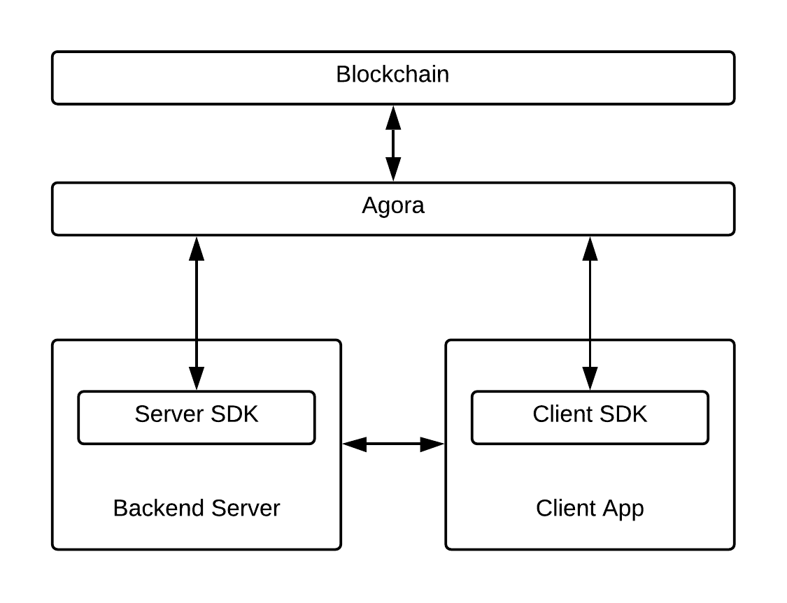

This overview will go over the high level components for a Kin app to function. Some components are hosted for developers to use if they wish, but others must be implemented and maintained by app developers. The high-level components are depicted below:

In the diagram above, developers are responsible for the Backend Server and Client App.

Below is a description of the architecture from the top down, beginning with the two components developers are _not_ responsible for: the Kin blockchain and Agora.

## Solana Blockchain

The Solana Blockchain is the digital ledger of transactions for all tokens created on it, meaning it acts as the source of truth for which transactions have occurred. It is decentralized - the information stored in the ledger is duplicated and distributed across multiple nodes that are maintained by various organizations. Key attributes include:

- **Scalable**: Solana leverages Proof of History and several other breakthrough innovations to allow the network to scale at the rate of Moore's Law.
- **Low Cost**: Never worry about rising fees as your user base grows. Solana is designed to keep fees low for applications with billions of users.
- **Composable**: Solana's single global state ensures composability between projects. Never deal with multiple shards or layer 2 systems.

App developers do not need to interact with the Solana Blockchain directly. Instead, requests for creating accounts and submitting transactions should be submitted through Agora.

## Agora

Agora is a blockchain-agnostic service that acts as the primary endpoint for SDKs (and the apps that use them) to communicate with the Kin blockchain. In addition to facilitating basic actions such as creating accounts and submitting transactions, it also provides additional functionality for developers to use, such as:

- A Memo format which allows the use of trusted off-chain payment-related data, providing a workaround the size restriction of the "extra data" that can be attached to a transaction
- Invoices, which help provide more meaningful data for sending, validating, and resolving history for different payments
- Configurable webhooks, which allow apps to validate and whitelist transactions prior to submission and to get notified when transactions complete
- An agnostic interface that allows for easier migration to future versions of Kin (i.e. if Kin switches blockchains) with minimal developer effort if a blockchain switch occurs

Agora uses [gRPC and protocol buffers](https://grpc.io/docs/what-is-grpc/introduction/). To make requests to Agora, developers can make use of one of the SDKs listed below without worrying about how to use gRPC and protobuf directly. Alternatively, developers more familiar with gRPC and protobuf can also opt to use the protobuf models and generated code defined in [kinecosystem/agora-api](http://github.com/kinecosystem/agora-api) to make requests to Agora without using the SDKs.

There are two ways for developers to use Agora: they can use the hosted version of Agora, or they can host their own instance of Agora (the source code can be found [here](http://github.com/kinecosystem/agora)). Developers who wish to use their own Agora instance must first still [register](/app-registration) to be eligible for the Kin Rewards Engine and fee-less transactions. The SDKs can be configured to point to either option.

Since the provided SDKs are already integrated with Agora, developers are not required to understand the details of specific API calls. However, those who wish to learn more about the APIs or use the APIs directly can look at the [Agora API Reference](agora/api).

### Environments

There are two Agora environments available for developers to use:

- **Test**: this environment is where developers should test their integration of Kin and interacts with a test version of the Solana blockchain. Developers can make use of the airdrop functionality available in all of our SDKs to fund accounts with Kin test tokens.
- Kin runs their own test cluster and you can view accounts and transactions on this test cluster by connecting to it on https://explorer.solana.com. From the site you should click “Mainnet Beta” on the top right and corner and then input https://local.validator.agorainfra.dev as your custom cluster. Now you can search by account -**Production**: this environment should be used by applications released to users. It interacts with the production blockchain, where all public transactions occur.

These two environments are designed to be as similar as possible, so developers can expect that integrations developed using the Development environment will work as expected on the Production environment. The client and server SDKs can be configured to use either of these environments. Developers should ensure that their client app and backend server have been configured to use the same environment when developing.

Alternatively, developers can make gRPC requests to Agora directly via the following endpoints (see the [Agora API Reference](agora/api) for more details):

- Test: `api.agorainfra.dev:443`
- Production: `api.agorainfra.net:443`

## App Components

As outlined in the diagram above, developers planning on building a Kin app should expect to implement and maintain both a user-facing client app and a backend server.

### Client App

The client app acts as the interface with users, allowing them to create, manage and use their Kin accounts. Two client SDKs are currently available: [Android](https://github.com/kinecosystem/kin-android) and [iOS](https://github.com/kinecosystem/kin-ios).

Creating an account for a user begins with creating an account keypair. The client SDKs provide classes and methods for creating and storing the account keypair, which is required for users to access their account. An account keypair consists of a public address (i.e. public key), and a private key (i.e. private/secret seed). The private key is stored on the user’s device and is only accessible by the app. After creating a keypair, the client SDK then submits a request to Agora to create the user's Kin account on the blockchain.

**Note: The private key is stored on the user's device. If they do not back it up and lose access to the device or delete the app, they will lose access to their Kin account.**

The client SDK also includes classes and methods for other functionality, including (but not limited to):

- sending Kin from the user account to another account, with optional [invoice support](/how-it-works#invoices)
- obtaining account balance
- listening for account events

For more details, please refer to each SDK's documentation:

- [Android](https://github.com/kinecosystem/kin-android)
- [iOS](https://github.com/kinecosystem/kin-ios)

### Backend Server

While a backend server is not required for a user to simply submit a transaction, most apps require one for creating more enhanced user experiences. Three server SDKs are currently available: [Go](https://github.com/kinecosystem/agora), [Python](https://github.com/kinecosystem/kin-python), and [Node.js](https://github.com/kinecosystem/kin-node). Some of the features these SDKs provide include:

- creating accounts and checking balances
- sending Kin transactions (including batched earns) from app accounts, with optional [invoice support](/how-it-works#invoices)
- checking transaction status

**Note: One of the primary purposes of this SDK is to securely transact and pay earns to your users using your developer wallet. This wallet needs to be safely stored on your server. Kin is money, and you need to make sure it’s protected.**

Additionally, having a backend server is required for making use of the offered [webhooks](/how-it-works#webhooks):

- Sign Transaction: allows apps to whitelist their user's transactions to avoid transaction fees
- Events: allows Agora to notify apps when transactions related to their app have completed

The server SDKs include classes and methods for assisting developers with handling webhook requests. For code examples and more details regarding the SDKs, please refer to each SDKs's documentation:

- [Go](https://github.com/kinecosystem/kin-go)
- [Python](https://github.com/kinecosystem/kin-python)
- [Node.js](https://github.com/kinecosystem/kin-node)
