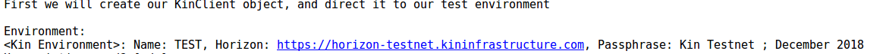
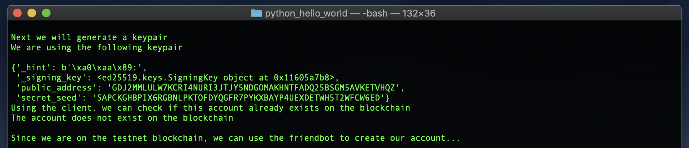
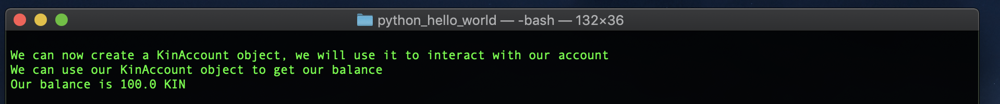
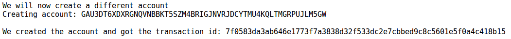
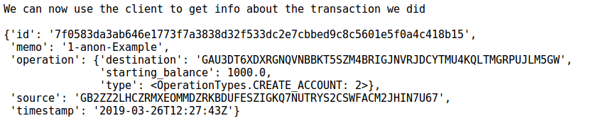
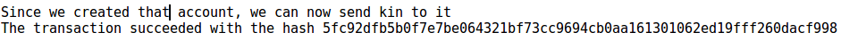
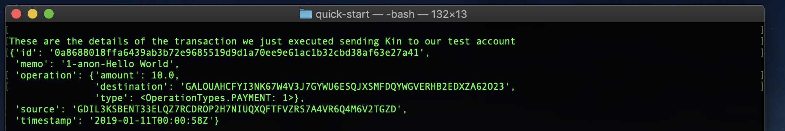

With the Kin SDK for Python, you can create a server back-end to support your client apps and integrate Kin. If you’re just getting started with Kin ecosystem, we suggest you spend a few minutes reading this [overview of the Kin architecture.](../kin-architecture-overview.md)

The following tutorial is meant to run on a server and will serve as a crash course on the basic functionalities of the Kin SDK for Python. As you implement Kin in your service, you should wrap this SDK in your back-end services as you see fit. Here we will simply look at the most basic functions of the Kin SDK for Python showing you how to create an account on the Kin Blockchain, execute a transaction and read the user's current balance.

This tutorial operates in the Kin Playground environment where you can develop and test your Kin integration.

This tutorial is designed to take you from start to finish in 5 minutes or less, so get ready!

## Setup
First of all, you need to install the Kin SDK. The Kin SDK requires Python 3 and is installed with pip:

```bash
pip install kin-sdk
```
## Code Walkthrough
This tutorial covers the primary elements of the script. See the Download link at the end of the article if you want to skip to the finished work.

The script simply executes a set of predefined commands. No user interaction is required except for the creation of a public address.

### The Basics
With the Kin SDK for Python installed, you can create the simple `main.py` script. Let's import `kin`.

```python
# This is the Kin SDK
import kin

# We'll be printing a few things to screen, so we also load pprint
from pprint import pprint
```

### Manage Accounts
Let's create two accounts: one for a user of your service and one to receive some Kin from your user.

Here you instantiate the `KinClient` and select in which environment you want to work. In this case, you'll work in the Playground (the test environment).

```python
    print('First we will create our KinClient object, and direct it to our test environment')
    async with kin.KinClient(kin.TEST_ENVIRONMENT) as client:

        print('\nEnvironment: ')
        print(client.environment)
```
###### Output:



#### Get a Keypair
With a `KinClient` instantiated, you are ready to either open or create the first account. Accounts always have a keypair of public address (the public address on the blockchain) and private key. *Remember to never share your private keys!*

The Kin SDK for Python generates a keypair based on a secret `seed`. There is a unique relationship between seed and keypair; if you save a secret seed, you can regenerate the associated keypair. A keypair contains 1 seed (aka private key) and 1 public key. You need a unique keypair for each user.

The code below is self-explanatory. The first time you execute this, you likely want to reply "n" to the request to use an existing seed. Feel free to save the secret seed after the first run and use it later for other tests.

```python
# Get keypair
existing = input('Use existing seed? [y/n]:  ')
if existing == 'y':
    seed = input('Input your seed: ')
    try:
        keypair = kin.Keypair(seed=seed)
    except kin.KinErrors.StellarSecretInvalidError:
        print('Your seed was not valid')
        raise
else:
    print('\nNext we will generate a keypair')
    keypair = kin.Keypair()

print('We are using the following keypair\n')
print(keypair)
```

###### Output



#### Check Account Existence and Create
Now that you have a keypair, you can check if the associated account already exists on the blockchain. If not, you'll create it.

**Note:** Creating a keypair does not mean that the account exists or is valid on the blockchain. You need to explicitly create an account using, for example, the following code:

```python
print('Using the client, we can check if this account already exists on the blockchain')
exist = await client.does_account_exists(keypair.public_address)
if exist:
    print('The account already exist on the blockchain')
else:
    print('The account does not exist on the blockchain')
    print('\nSince we are on the testnet blockchain, we can use the friendbot to create our account...\n')
    await client.friendbot(keypair.public_address)

# Init KinAccount
print('We can now create a KinAccount object, we will use it to interact with our account')
account = client.kin_account(keypair.secret_seed)
```

###### Output



Details of the `friendbot` service are too detailed for our Hello World tutorial, so when you're ready you should read [this](../documentation/python-sdk#friendbot).

### Get Balance
Whether you created a new account or opened an existing one, you can now perform the most basic action - check the  account balance. The `account` object provides a few basic methods including `get_balance()`.

```python
print('We can use our KinAccount object to get our balance')
print('Our balance is {} KIN'.format(await account.get_balance()))
```

As you see, the new account already has Kin in it! True to its name `friendbot` kindly gave us some Kin to get started.

### Create a New Account
Let's do something more interesting now: let's send Kin to another account. For simplicity, create a new account, but of course you can send Kin to any account on the blockchain as long as you know its address (public key). (Sending Kin to your own public address won't work). Note that the owner of the account to which your user will transfer Kin may or may not be another of your users.

```python
# Create a different account
print('\nWe will now create a different account')
new_keypair = kin.Keypair()
print('Creating account: {}'.format(new_keypair.public_address))
tx_hash = await account.create_account(new_keypair.public_address, starting_balance=1000, fee=100, memo_text='Example')
print('\nWe created the account and got the transaction id: {}'.format(tx_hash))
```

###### Output



### Get the Details of a Transaction
Let's print information about the last action performed.

```python
# Get info about a tx
print('\nWe can now use the client to get info about the transaction we did\n')
transaction = await client.get_transaction_data(tx_hash=tx_hash)
# We don't have __str__ for the transaction class, so we print it like this till we add it
transaction.operation = vars(transaction.operation)
pprint(vars(transaction))
```

###### Output



### Send Kin
Now that you have a destination public address, you can send Kin to the associated account. `new_keypair` holds the information of the destination account. You are going to send 10 KIN. Executing this transaction will by default incur a cost of 100 FEE. (1 KIN = 10<sup>-5</sup> FEE)

Not all transactions executed on the blockchain will be charged fee. To learn more about transaction fees and whitelisting, see [Whitelist](../documentation/python-sdk#transferring-kin-to-another-account-using-whitelist-service).

```python
tx_hash = await account.send_kin(new_keypair.public_address, amount=10, fee=100, memo_text='Hello World')
print('The transaction succeeded with the hash {}'.format(tx_hash))
```

###### Output



Check and print transaction details.

```python
transaction = await client.get_transaction_data(tx_hash=tx_hash)

# We don't have __str__ for the transaction class, so we print it like this till we add it
transaction.operation = vars(transaction.operation)
print('\nThese are the details of the transaction we just executed sending Kin to our test account')
pprint(vars(transaction))
```

###### Output



Lastly, check the updated balance.

```python
print('Updated balance is {}'.format(await client.get_account_balance(new_keypair.public_address)))
```

## Conclusions
This was a very short introduction to the Kin SDK for Python. This SDK is meant to run on a server and be between your client apps and the Kin Blockchain. The SDK provides plenty more features for you to explore including support for channels to maximize your transaction throughput.

[//]: # (## Downloads)

[//]: # (Download the full main.py for your convenience.)

[//]: # (Track progress and download the Python SDK on GitHub.)
