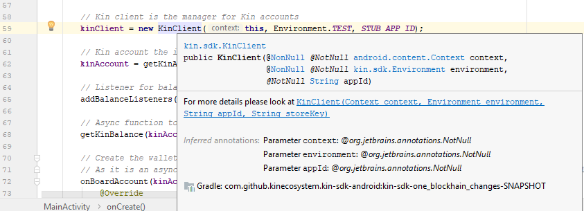
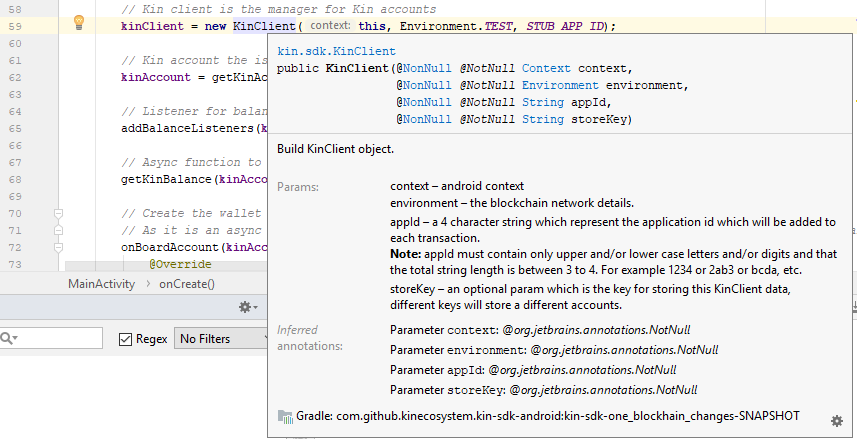

As you probably expect from the name, this article provides a quick code walk-through demonstrating all the key concepts you need to create Android clients that allow your users to earn, spend, and manage Kin. We'll demonstrate it in an Android Studio environment, but the concepts apply regardless of the IDE you use.

## Import project

From Android Studio, select `File > New > Project from Version Control > Git` and enter this URL to load the Kin SDK for Android into Android Studio:

**https://github.com/kinecosystem/kin-sdk-android**

Because Hello World for Android is a work in progress tracking the migration to the Kin Blockchain, we have not yet incorporated it into the master branch of the Kin SDK for Android repository.

To open the development branch where you'll find the Hello World app, in Android Studio select `VCS > Git > Branches`. Under `Remote Branches` select the one that mentions 'create Hello World app' then `check out as local branch`.

From the project window navigate to `kin-sdk > samples > hello-world > src > main > java > com.example.hello_world` and open file `MainActivity.java`.

With that out of the way, we can start looking at the code.

**Note:** As of this writing we have tested the Hello World for Android app using Android Studio 3.2 and emulators running Android API level 26.

## Connecting to Kin Blockchain

One of the first statements executed when the app is created connects to the test environment of the Kin Blockchain.

```java
        // Kin client is the manager for Kin accounts
        kinClient = new KinClient(this, Environment.TEST, STUB_APP_ID);
```
`Environment.TEST` is a public static variable that includes `networkURL`, `networkPassphrase`, and `issuerAccountID`. `networkURL` is the location of a [Horizon server](../kin-architecture-overview.md/#horizon-servers) providing access to the test blockchain.

`STUB_APP_ID` should be replaced with your `appId` once your app is in production. An `appID` is a 4-character string assigned to you by Kin and used to identify your application. It contains only digits and upper and/or lower case letters. While you are testing your integration in the Kin Playground environment you can use any string of four characters as long as you only use digits and upper or lower case letters.

Your `appID` is automatically added to the `memo` field. For more information see the [executing a transaction](#executing-a-transaction) section.


## KinClient
The `KinClient` class contains methods for managing accounts on the Kin Blockchain. To explore those methods, place your cursor on `KinClient` and press `ctl-q` on Windows or `ctl-J` on Mac to produce:



Then click  the `For more details ...` link to see full documentation:



## Create kinAccount object

The KinAccount class deals with specific accounts on the Kin Blockchain.   

```java
        // Kin account the is the entity that holds Kin
        kinAccount = getKinAccount(APP_INDEX);
```

When the above snippet creates the kinAccount object, `getKinAccount` will begin the process of adding an account to the Kin Blockchain. When this function completes, there will be a keypair associated with the new account stored securely on the local client.

```   public KinAccount getKinAccount(int index) {
        // The index that is used to get a specific account from the client manager
        KinAccount kinAccount = kinClient.getAccount(index);
        try {
            // Creates a local keypair
            if (kinAccount == null) {
                kinAccount = kinClient.addAccount();
                Log.d(TAG, "Created new account succeeded");
            }
        } catch (CreateAccountException e) {
            e.printStackTrace();
        }

        return kinAccount;
    }
```

## Listen for account balance changes

Kin SDK for Android provides a set of listeners that allow you to receive callbacks when certain events take place on the blockchain. For example, you can listen for any change in the balance of Kin held in an account.

**Note** In a production environment the newly added account would not yet be live on the Kin Blockchain, and therefore attempting to add a listener to a non-existing account would result in an error. But this is a test environment and we know the account already exists.

```java
        // Listener for balance changes
        addBalanceListeners(kinAccount);
```

When the above snippet calls the below function you will see a log entry reporting the balance of the account on the Kin Blockchain.

```java
    public void addBalanceListeners(KinAccount account) {
        account.addBalanceListener(
            balance -> Log.d(TAG, "balance event, new balance is = " + balance.value().toPlainString()));
    }
```

## Onboard kinAccount

Onboarding is the process of sending an async request to the Horizon server requesting a new account be added to the Kin Blockchain. The Hello World code accomplishes two tasks while onboarding.

First, it sends the onboarding request and logs the success upon callback.  

```java
        // Add the account to the Kin Blockchain
        onBoardAccount(kinAccount, new Callbacks() {
                Log.d(TAG, "Onboarding succeeded");
...

            @Override
            public void onFailure(Exception e) {
                Log.e(TAG, "Onboarding failed");
            }
        });
    }
```
## Transfer Kin

After onboarding succeeds, the code transfers 5 KIN to another account. The public address of an account is the public key created when a local keypair is generated.

```java
        // Add the account to the Kin Blockchain
        // As it is an async request, at the callback we will be able to transfer Kin and check the account balance
        onBoardAccount(kinAccount, new Callbacks() {
                Log.d(TAG, "Onboarding succeeded");
            @Override
            public void onSuccess() {
                transferKin(kinAccount, TARGET_WALLET, AMOUNT_KIN);
            }

            @Override
            public void onFailure(Exception e) {
                Log.e(TAG, "Onboarding failed");
            }
        });
    }
```

## Understanding balance results

Note that when the app transfers 5 KIN to another account, the balance in the account decreases by 5.01 KIN. The addition 0.01 KIN is the fee charged by the blockchain for executing the transaction.

Blockchain charges are demoninated in Fee, where 1 KIN = 10E5 FEE.

Not all blockchain transactions are charged Fee. Some apps (identified by `appID`) can be placed on a Whitelist, allowing users to execute transactions without being charged. Whitelisting requires a live app server and is beyond the scope of this Hello World client overview.

For more information on Whitelisting transactions see [transferring Kin to another account using whitelist service](../documentation/android-sdk.md/#transferring-kin-to-another-account-using-whitelist-service).

## Executing a transaction

Every transaction added to the Kin Blockchain includes a unique identification that is the hash of the transaction payload.

Notice how the `transferKin` function builds the transaction request locally, records the transaction ID, then sends the transaction to the Horizon server for execution.

Knowing the transaction ID in advance of sending the request is important for exception handling. For example, it is possible to experience a network outage after a request is successfully sent but before any callback is received. When network access is restored you can query the blockchain for the status of the transaction in question to determine next steps.

In this function we use two methods of the Kin SDK:

- `buildTransaction` builds the transaction locally and expects 4 parameters, the recipient's public address, the amount of Kin to transfer, the fee and a memo
- `sendTransaction` only expects the `transaction` object returned by buildTransaction.

The `memo` field allows developers to add a note to any transaction and accepts up to 21 characters. The `appID` is automatically added to all transactions in the memo field.

```java
   public void transferKin(KinAccount sender, String targetPublicAddress, BigDecimal amountInKin) {

        sender.buildTransaction(targetPublicAddress, amountInKin, FEE, MEMO).run(new ResultCallback<Transaction>() {

            @Override
            public void onResult(Transaction transaction) {
                Log.d(TAG, "The transaction id before sending: " + transaction.getId().id());

                sender.sendTransaction(transaction).run(new ResultCallback<TransactionId>() {

                    @Override
                    public void onResult(TransactionId id) {
                        Log.d(TAG, "The transaction id: " + transaction.getId().id());
                        getKinBalance(kinAccount);
                    }

                    @Override
                    public void onError(Exception e) {
                        e.printStackTrace();
                    }
                });
            }

            @Override
            public void onError(Exception e) {
                e.printStackTrace();
            }

        });
    }

```
